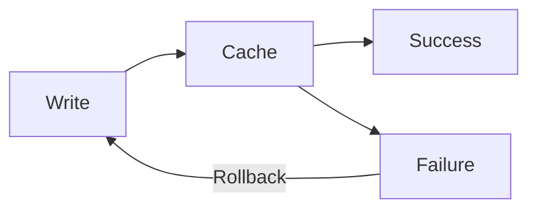

# Writing Documentation as Wisdom Triggers

> **Mission**: Encode durable wisdom in minimal tokens, creating triggers that activate full understanding in any cognitive system.

Write to activate understanding, not to transcribe knowledge. Create a **lattice of retrieval cues** rather than a transcript of information.

## Core Principles

### 1. 🧠 Shared Cognition: Design for How Minds Work

**Applicability**: 👤 Human: 90% | 🤖 LLM: 85%

Both biological and artificial minds exhibit:
- **Limited working memory** → Use chunks of 3-7 concepts
- **Attention biases** → U-shaped focus (primacy/recency effects)
- **Pattern recognition** → Leverage familiar structures
- **Associative retrieval** → Consistent cues trigger memories

**Example**:
```markdown
❌ HOSTILE: "The system uses various approaches depending on factors..."
✅ FRIENDLY:
  1. PII → Encrypted PostgreSQL
  2. Sessions → Redis (24h TTL)
  3. Analytics → BigQuery (aggregated)
```

### 2. 🎯 Token Economics: Every Token Must Earn Its Place

**Applicability**: 👤 Human: 30% | 🤖 LLM: 100%

Modern LLMs use subword tokenization that affects concept integrity:
- `CamelCase` → Often single token
- `hyphenated-terms` → Usually 3+ tokens
- Common phrases → Fewer tokens than synonyms

See @token-optimization.md for advanced techniques.

### 3. 📦 Capsule Architecture: Compress Wisdom Into Invariants

**Applicability**: 👤 Human: 95% | 🤖 LLM: 90%

Distill each concept into a stable, minimal truth that can be expanded when needed.

See @capsule-pattern.md for complete format and examples.

### 4. 🔗 Embedding-First Design: Write for Vector Search

**Applicability**: 👤 Human: 40% | 🤖 LLM: 95%

Each documentation chunk should be a self-contained semantic unit:
- **Modular sections** that make sense in isolation
- **Topic sentences** that summarize each chunk
- **Metadata tags** for filtering: `[Security]`, `[Performance]`
- **Semantic boundaries** at paragraph breaks

### 5. 🎨 Multi-Modal Encoding: Visual + Verbal + Semantic

**Applicability**: 👤 Human: 100% | 🤖 LLM: 70%

Use Mermaid diagrams with assistive comments:



**⚠️ CRITICAL**: Always escape Mermaid labels with quotes:
```mermaid
❌ WRONG: A[User Request] --> B{Complex Task?}
✅ RIGHT: A["User Request"] --> B{"Complex Task?"}
```

## Two-Tier Knowledge Architecture

### 📚 Tier 1: Knowledge Base (High Fidelity)
Comprehensive, authoritative documents on specific concepts:
- Deep technical details
- Edge cases and exceptions
- Historical context and decisions
- Implementation guidance

Location: `/docs/concepts/[concept-name].md`

### 📖 Tier 2: Synthesis Documents (Accessible)
Practical guides that combine multiple concepts:
- 80% of value in 20% of tokens
- Clear links to source concepts
- Unified examples showing interaction
- Task-oriented organization

Location: `/docs/guides/[guide-name].md`

## Structural Patterns

### The SABER Pattern

For critical technical sections, document:

```markdown
## 🚨 CRITICAL: Payment Processing

**S**ecurity: PCI compliance required, no card storage
**A**lways: Use idempotency keys, maintain audit trail
**B**oundaries: $0.50 min, $10,000 max, 30s timeout
**E**rrors: Log full details, return safe messages
**R**etries: Max 3, exponential backoff, stop on new errors
```

See @saber-pattern.md for complete framework.

### Invariant + Cue Pairing

```markdown
**Invariant**: "Verify early, trust completely" {VETC}

Throughout our system, VETC means validating at edge, then using
trusted internal tokens. This verify-early pattern prevents
deep security checks in every service.
```

## The Writing Process

### 📝 Pre-Write: Design Your Triggers

Before writing, identify:
1. The **single concept** to convey
2. Its **canonical name** (token-friendly)
3. The **invariant truth** (≤25 tokens)
4. The **category/emoji** marker
5. Which **tier** it belongs to

### ✍️ Write: Layer Your Wisdom

1. **Capsule first** - The irreducible truth
2. **Example second** - Concrete instantiation
3. **Details last** - For those who need depth
4. **Visual when helpful** - Mermaid + meaning
5. **Links to sources** - For knowledge base items

### 🔍 Review: Validate Retrieval

See @writing-checklist.md for complete validation checklist.

### 🔄 Maintain: Preserve Triggers While Updating Details

When updating:
- **Invariants stay stable** (they're the retrieval cues)
- **Examples can change** (keep them current)
- **Details expand** (add new edge cases)
- **Links get verified** (prevent drift)

## Consolidation Principle

After iterations, consolidate with these lenses:
1. **Token Efficiency**: Can I say this in fewer tokens?
2. **Embedding Coherence**: Is each chunk semantically focused?
3. **Retrieval Precision**: Will search find this easily?
4. **Cognitive Load**: Am I respecting attention limits?
5. **Pattern Clarity**: Are the relationships obvious?

## Success Metrics

Your documentation succeeds when:
- ✅ Readers grasp concepts in seconds, not minutes
- ✅ AI finds and extracts exactly what's needed
- ✅ Knowledge transfers intact across contexts
- ✅ Updates preserve retrieval while adding detail
- ✅ Complex systems become navigable

---

**Remember**: We're not writing documentation. We're encoding **wisdom triggers** that activate understanding in any mind that encounters them.

## References

- @capsule-pattern.md - Capsule architecture format and examples
- @saber-pattern.md - SABER pattern for critical sections
- @token-optimization.md - Advanced token optimization tactics
- @writing-checklist.md - Pre-write and review checklists
